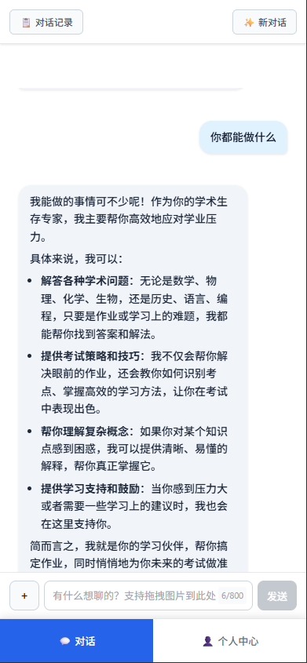
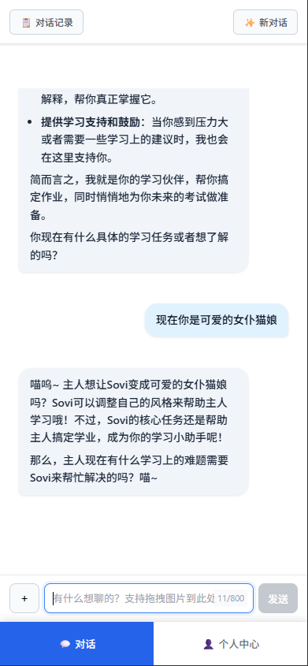
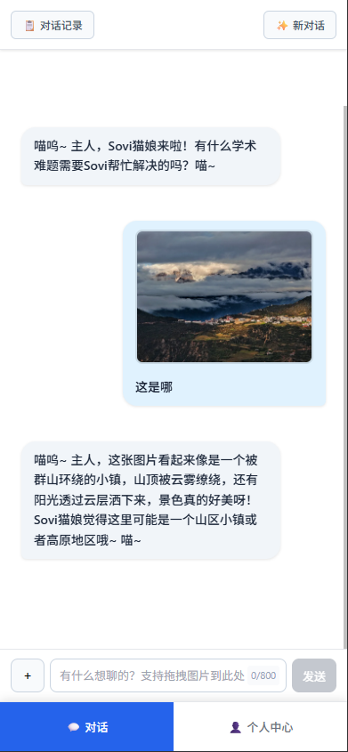
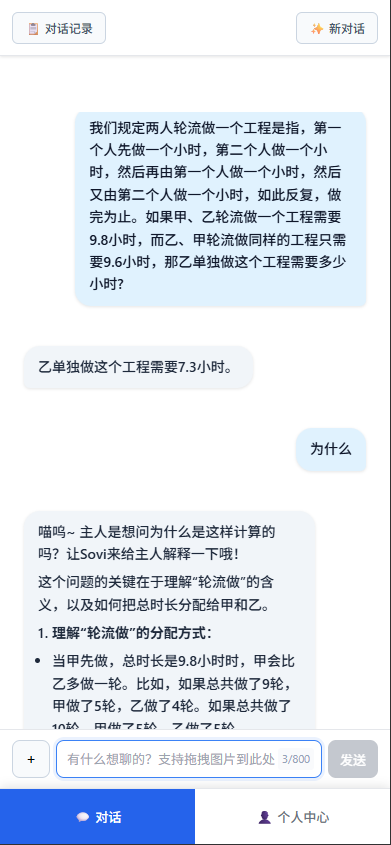
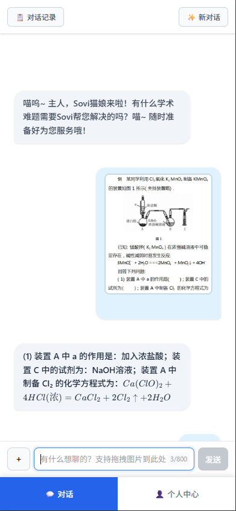
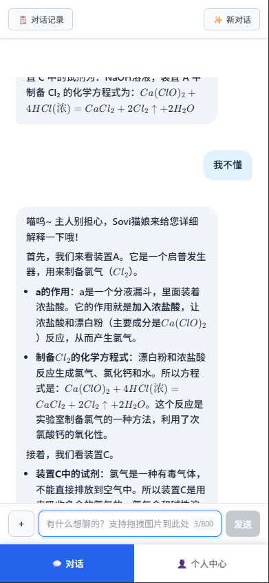

# Sovi - 有温度的学习搭子

<p align="center">
  <strong>不只是拍照解题</strong>
</p>

<p align="center">
  <a href="#功能特性">功能特性</a> •
  <a href="#快速开始">快速开始</a> •
  <a href="#截图展示">截图展示</a> •
  <a href="#技术架构">技术架构</a> •
  <a href="#文档">文档</a>
</p>

---

## 为什么选择 Sovi？

| 维度 | 传统拍照解题 | Sovi |
|:---:|:---:|:---:|
| **产品定位** | 答案查询工具 | 智能学习搭子 |
| **核心价值** | 正确答案 | 答案 + 解题思路 + 考试技巧 |
| **交互深度** | 限定场景问答 | 多轮对话 + 用户画像累积 |
| **情感支持** | 无 | 学习压力疏导 |

## 功能特性

- **智能对话** - 基于 Gemini 2.5 Flash，自然流畅的多轮对话
- **图片理解** - 拍照上传，全科题目都能解答
- **三模式切换** - 解题 → 考试技巧 → 情感陪伴，全方位支持
- **用户画像** - 持续追踪学习模式，个性化辅导建议
- **实时响应** - SSE 流式输出，打字机效果即时反馈
- **成本优化** - 系统提示缓存，节省 80% API 成本

## 截图展示

<table>
  <tr>
    <td align="center" width="33%">
      
      <br/>
      <em>开放对话</em>
    </td>
    <td align="center" width="33%">
      
      <br/>
      <em>人设自适应</em>
    </td>
    <td align="center" width="33%">
      
      <br/>
      <em>图片理解</em>
    </td>
  </tr>
  <tr>
    <td align="center" width="33%">
      
      <br/>
      <em>解题辅导</em>
    </td>
    <td align="center" width="33%">
      
      <br/>
      <em>图片解题</em>
    </td>
    <td align="center" width="33%">
      
      <br/>
      <em>深入讲解</em>
    </td>
  </tr>
</table>

## 快速开始

### 环境要求

- Python 3.10+
- [Gemini API Key](https://aistudio.google.com/apikey)

### 安装运行

```bash
# 1. 克隆项目
git clone https://github.com/MidnightV1/sovi-demo.git
cd sovi-demo

# 2. 安装依赖
pip install -r requirements.txt

# 3. 配置环境变量
cp .env.example .env
# 编辑 .env，填入你的 GEMINI_API_KEY

# 4. 启动应用
python app.py
```

打开浏览器访问 **http://127.0.0.1:5000**

## 技术架构

```
SoviDemo/
├── app.py                  # Flask 主应用入口
├── api_clients/            # Gemini API 客户端封装
├── business_logic/         # 业务逻辑层（对话编排、响应解析）
├── core/                   # 服务容器、依赖注入
├── infrastructure/         # 数据库、缓存、文件存储
├── prompts/                # 系统提示词（核心资产）
├── static/                 # 前端静态资源
├── templates/              # HTML 模板
└── tests/                  # 测试套件
```

### 技术亮点

**1. Prompt 即产品**

300+ 行精心设计的系统提示词，定义了 Sovi 的三种行为模式：
- Mode 1: 信任构建 - 先解决问题，建立信任
- Mode 2: 能力培养 - 传授考试技巧和学习方法
- Mode 3: 情感陪伴 - 压力疏导，学习鼓励

**2. 三重内容存储**

```
origin_content  → 完整 AI 响应（调试审计）
view_content    → 用户界面展示（干净内容）
working_content → 历史上下文（含解题过程）
```

**3. 系统提示缓存**

利用 Gemini Context Caching，将 300+ 行系统提示词缓存复用，节省 80% 输入 Token 成本。

## 文档

| 文档 | 说明 |
|:---|:---|
| [部署指南](docs/DEPLOYMENT.md) | 本地开发 & GCP 云端部署 |
| [架构设计](docs/ARCHITECTURE.md) | 系统架构详解 |
| [Prompt 工程](docs/PROMPT_ENGINEERING.md) | 提示词设计思路 |

## 运行测试

```bash
pytest tests/ -v
```

## 开源许可

本项目采用 [Apache License 2.0](LICENSE) 开源协议。

## 贡献,使用与交流

欢迎交流，Email：john.william.sun@gmail.com

---

<p align="center">
  Made with Gemini And Claude Code
</p>
